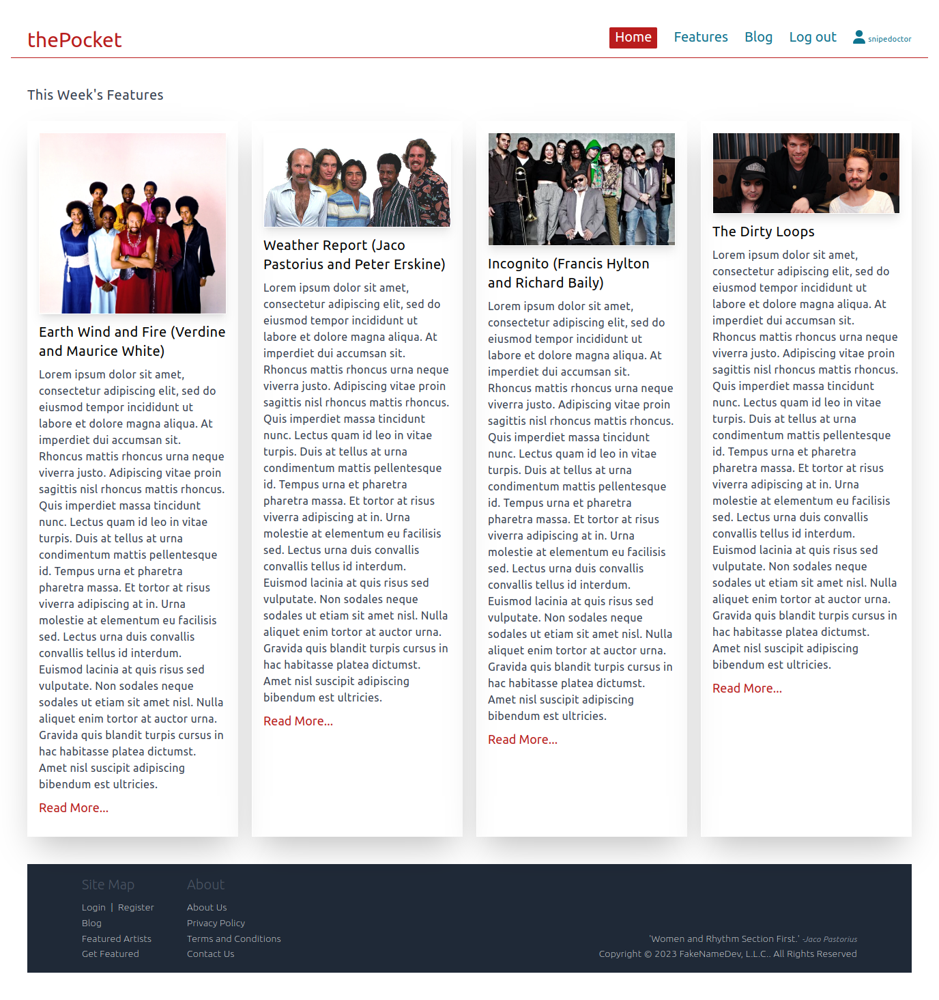

# thePocket

A Django MVC Blog For the Rhythm Section Community

## Introduction

This project began as a tutorial for the purpose of a hands-on learning experience with Django-Python and PyCharm.
As I got further into the tutorial, and felt as though I had a good grasp on how Django flowed and operated, the project
began to morph into this Blog.

## Features
* Python v3.11.4
* Django v3.2.12
* TailwindCSS (CDN)
* requirements.txt
* virtual environment
* sqlite3 (default)

## Contact
[wlowrimore@gmail.com](mailto://wlowrimore@gmail.com)n\
[www.williamlowrimore.com](https://www.williamlowrimore.com)n\
[www.linkedin.com](https://www.linkedin.com/in/william-lowrimore-21778310)
 
 
This project was built using PyCharm.
 
 
Copyright &copy; 2023 William Lowrimore, All Rights Reserved 