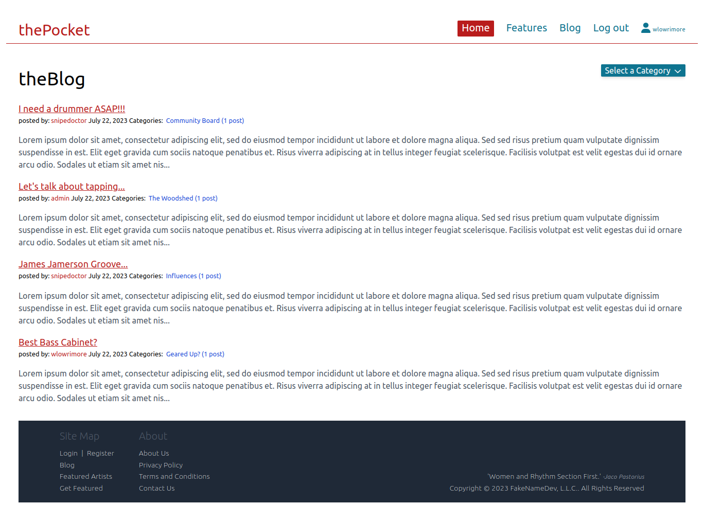
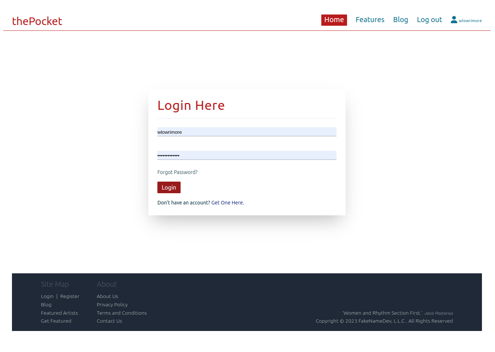

# thePocket

A Django MVP Blog For the Rhythm Section Community

## Introduction

' thePocket '&trade; is a Full Stack Blog created with Django | Python.    Enter the site with immediate access to
view features and submit contact
information. In order to view and participate in the Blog, the user must first create a user account by way of the '
Register
Here' page. Once a basic user account is created, the user will have access to the "Profile Details" page where they
have the permission to update: username, first and last name, email address, location, bio., password, and profile
picture. For the user who hasn't visited the site in a while and may have forgotten their password, a "forgot password"
link can be found on the login page. 

* ' thePocket '&trade; is and will remain in development mode as an ongoing learning tool for myself and potential future
teammates.  
* ' thePocket '&trade; is a desktop site that is not yet mobile responsive.  However, if ever it is decided to publish
' thePocket '&trade;, the code will be refactored to accommodate mobile devices.

## Features and Technologies

* Python v3.11.4
* Django v3.2.12
* PyCharm
* JavaScript
* FontAwesome
* TailwindCSS (CDN)
* requirements.txt
* virtual environment
* sqlite3 (default)

## requirements.txt

* asgiref==3.7.2
* Django==4.2.3
* django-browser-reload==1.10.0
* django-six==1.0.5
* django-tailwind==3.6.0
* fontawesomefree==6.4.0
* Pillow==9.5.0
* six==1.16.0
* sqlparse==0.4.4
* typing_extensions==4.6.3

## Contact

[wlowrimore@gmail.com](mailto://wlowrimore@gmail.com)\
[www.williamlowrimore.com](https://www.williamlowrimore.com)\
[www.linkedin.com](https://www.linkedin.com/in/william-lowrimore-21778310)
 
 
Copyright &copy; 2023 William Lowrimore, All Rights Reserved 